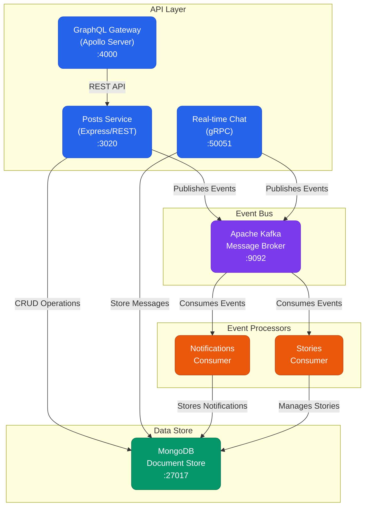
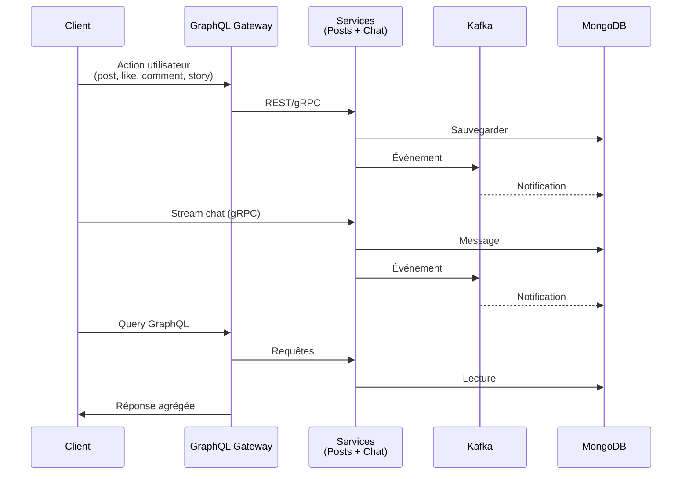

# Réseau Social - Architecture Microservices avec DevOps

## Vue d'Ensemble

Cette plateforme de réseau social est construite sur une architecture de microservices conteneurisée et déployée sur Kubernetes. Le projet intègre des pratiques DevOps avancées incluant l'intégration continue, le déploiement continu, et l'observabilité.

### Fonctionnalités
- Partage de posts et stories éphémères
- Chat en temps réel
- Système de notifications
- API GraphQL unifiée
- Monitoring avec Prometheus et Grafana

### Technologies principales
- **Backend**: Node.js, Express.js, Apollo Server, gRPC
- **Base de données**: MongoDB avec Mongoose
- **Messagerie**: Kafka avec Zookeeper
- **Conteneurisation**: Docker, Docker Compose
- **Orchestration**: Kubernetes (Docker Desktop)
- **CI/CD**: Jenkins avec intégration Docker Hub
- **Sécurité**: Analyse de vulnérabilités avec Trivy
- **Monitoring**: Prometheus, Grafana
- **Infrastructure as Code**: Helm Charts, Kubernetes Manifests

## Structure du Projet DevOps

```
projet-micro/
├── .github/                   # Fichiers de configuration GitHub
├── helm/                     # Charts Helm pour le déploiement
├── jenkins/                  # Fichiers de configuration Jenkins
├── k8s/                      # Manifests Kubernetes
│   ├── argocd.yaml           # Configuration ArgoCD
│   ├── chat-service.yaml     # Service de chat
│   ├── graphql-service.yaml  # Service GraphQL
│   ├── kafka-consumers.yaml  # Consommateurs Kafka
│   ├── kafka.yaml            # Configuration Kafka
│   ├── mongodb.yaml          # Configuration MongoDB
│   ├── namespace.yaml        # Définition du namespace
│   ├── posts-service.yaml    # Service de posts
│   └── zookeeper.yaml        # Configuration Zookeeper
├── monitoring/               # Configuration du monitoring
│   ├── grafana-k8s.yaml      # Déploiement Grafana
│   ├── prometheus-k8s.yaml   # Déploiement Prometheus
│   └── prometheus.yml        # Configuration Prometheus
├── services/                 # Code source des services
├── .dockerignore             # Fichiers ignorés par Docker
├── .gitignore               # Fichiers ignorés par Git
├── deploy-k8s.ps1           # Script de déploiement Kubernetes
├── docker-compose.yml        # Configuration Docker Compose
├── Jenkinsfile              # Pipeline CI/CD
└── README.md                # Ce fichier
```

## Prérequis

- Docker Desktop avec Kubernetes activé
- kubectl
- Helm
- ArgoCD (optionnel pour GitOps)
- Un compte Docker Hub

## Démarrage rapide

### 1. Démarrer avec Docker Compose

```bash
docker-compose up -d
```

### 2. Déploiement sur Kubernetes local

1. Activer Kubernetes dans Docker Desktop
2. Appliquer les configurations :

```bash
# Créer le namespace
kubectl apply -f k8s/base/namespace.yaml

# Déployer les bases de données
kubectl apply -f k8s/base/mongodb-deployment.yaml
kubectl apply -f k8s/base/zookeeper-deployment.yaml
kubectl apply -f k8s/base/kafka-deployment.yaml

# Déployer les services
kubectl apply -f k8s/services/posts-service/deployment.yaml
kubectl apply -f k8s/services/chat-service/deployment.yaml
kubectl apply -f k8s/services/graphql-service/deployment.yaml
kubectl apply -f k8s/services/kafka-consumers/notifications-deployment.yaml
kubectl apply -f k8s/services/kafka-consumers/stories-deployment.yaml

# Déployer le monitoring
kubectl apply -f k8s/monitoring/prometheus/prometheus-deployment.yaml
kubectl apply -f k8s/monitoring/grafana/grafana-deployment.yaml
```

### 3. Accès aux services

- **GraphQL API**: http://localhost:4000/graphql
- **Prometheus**: http://localhost:9090
- **Grafana**: http://localhost:3000 (admin/admin)

## CI/CD avec Jenkins

Le pipeline Jenkins effectue les étapes suivantes :
1. Vérification du code source
2. Installation des dépendances
3. Exécution des tests
4. Construction des images Docker
5. Analyse de sécurité avec Trivy
6. Push vers Docker Hub
7. Déploiement sur Kubernetes

## Monitoring et Observabilité

Le projet inclut :
- **Prometheus** pour la collecte des métriques
- **Grafana** pour la visualisation
- Métriques d'application et d'infrastructure
- Tableaux de bord prédéfinis

## Sécurité

- Analyse des vulnérabilités avec Trivy
- Séparation des préoccupations avec les namespaces
- Configuration des limites de ressources
- Politiques de sécurité réseau

## Dépannage

### Voir les logs des pods
```bash
kubectl logs -n social-network <pod-name>
```

### Accéder à un shell dans un pod
```bash
kubectl exec -it -n social-network <pod-name> -- /bin/bash
```

### Redémarrer un déploiement
```bash
kubectl rollout restart deployment -n social-network <deployment-name>
```

## Licence

Ce projet est sous licence MIT. Voir le fichier [LICENSE](LICENSE) pour plus de détails.

```
projet-micro/
├── services/
│   ├── posts-service/       # Service REST pour les posts
│   │   └── app.js
│   ├── graphql-service/     # Service GraphQL
│   │   └── server.js
│   ├── chat-service/        # Service gRPC pour le chat
│   │   ├── server.js
│   │   └── chat.proto
│   └── kafka-consumers/     # Consumers Kafka
│       ├── stories.js
│       └── notifications.js
├── package-lock.json
├── package.json
└── .env
```


## Architecture Technique
Le système est composé de plusieurs services qui communiquent entre eux via différents protocoles:
- API Gateway: Point d'entrée principal pour les clients 
- Service GraphQL: Interface unifiée pour les requêtes de données
- Service Posts: Gestion des publications et des stories
- Service Stories: Traitement des événements liés aux stories
- Service Notifications: Traitement des notifications utilisateur
- Service Chat: Communication en temps réel via gRPC

Ces services communiquent entre eux principalement via Kafka pour les communications asynchrones événementielles, et utilisent MongoDB comme base de données commune.



## Services Détaillés

### 1. Posts Service (Port 3000)

Ce service gère les posts et les stories via une API REST. Il permet de:
- Créer, lire, commenter et liker des posts
- Créer et lire des stories éphémères (24h)
Le service publie des événements sur Kafka pour informer les autres services des activités pertinentes.

#### Points d'API principaux:

- POST /posts: Créer un nouveau post
- GET /posts: Récupérer tous les posts
- POST /posts/:id/like: Aimer un post
- POST /posts/:id/comments: Commenter un post
- GET /posts/:id/comments: Récupérer les commentaires d'un post
- POST /stories: Créer une nouvelle story
- GET /stories: Récupérer toutes les stories actives
- GET /stories/user/:userId: Récupérer les stories d'un utilisateur spécifique


### 2. GraphQL Service (Port 4000)
Ce service fournit une API GraphQL qui sert de façade pour les autres services. Il offre:
- Un point d'entrée unifié pour les requêtes clients
- Des resolvers qui communiquent avec le service Posts via HTTP
- Une interface structurée pour récupérer les posts et leurs données associées

#### Types GraphQL

##### Post
- id: ID!
- content: String!
- userId: String!
- likes: Int!
- comments: [Comment!]!
- createdAt: String!

##### Comment
- text: String!
- userId: String!
- createdAt: String!

#### Requêtes Disponibles
- feed(userId: ID!): [Post!]!
- post(id: ID!): Post

### 3. Chat Service 
Ce service implémente une API gRPC pour la messagerie en temps réel. Il permet:
- L'envoi de messages privés entre utilisateurs
- La souscription en streaming pour recevoir des messages en temps réel
- La persistance des messages dans MongoDB
- La publication d'événements de notification via Kafka

### 4. Notification Consumer
Ce service écoute les événements sur le topic Kafka 'notifications' et crée des notifications dans la base de données. Il traite:
- Les likes sur les posts
- Les commentaires sur les posts
- Les nouveaux messages chat

#### Modèle de Notification
- Type (LIKE, COMMENT, CHAT_MESSAGE)
- Émetteur (userId)
- Destinataire (targetUserId)
- Références (postId, commentId)
- État de lecture
- Horodatage

### 5. Stories Consumer

Ce service gère le cycle de vie des stories éphémères. Il:
- Écoute les événements sur le topic Kafka 'stories'
- Traite les événements de création de stories
- Gère l'expiration des stories (24h après leur création)
- Publie des notifications pour informer les abonnés des nouvelles stories

#### Modèle de Story
- Contenu
- Auteur
- Date de création
- Date d'expiration

## Flux de Données




## Configuration Technique

### Variables d'Environnement
Créez un fichier `.env` à la racine du projet avec les variables suivantes :

```env
# Base de données
MONGODB_URI=mongodb://localhost:27017/social-network

# Services
POSTS_SERVICE_PORT=3020
GRAPHQL_PORT=4000
CHAT_SERVICE_PORT=50051

# Message Broker
KAFKA_BROKERS=localhost:9092
KAFKA_CLIENT_ID=social-network

# Configuration
STORY_EXPIRATION_HOURS=24
NODE_ENV=development
```

### Dépendances Principales
- Express.js (API REST)
- Apollo Server (GraphQL)
- KafkaJS (Message Broker)
- Mongoose (MongoDB ODM)

## Guide d'Installation

### Prérequis
- Node.js v16+ 
- MongoDB 4.4+
- Apache Kafka 2.8+
- Zookeeper 3.8+
- Docker (optionnel)

### Installation et Démarrage

1. **Configuration Initiale**
   ```bash
   # Cloner le projet
   git clone <https://github.com/amalbenalii/projet-micro.git>
   cd projet-micro

   # Installer les dépendances du projet
   npm install              # Installe toutes les dépendances listées dans package.json

   ```

2. **Configuration de l'Infrastructure**
   
   b. **Apache Kafka**
   ```bash
   # Démarrer Zookeeper (Windows)
   .\bin\windows\zookeeper-server-start.bat .\config\zookeeper.properties

   # Démarrer Kafka (dans un nouveau terminal)
   .\bin\windows\kafka-server-start.bat .\config\server.properties

   # Créer les topics nécessaires
   .\bin\windows\kafka-topics.bat --create --topic notifications --bootstrap-server localhost:9092 --partitions 3 --replication-factor 1
   .\bin\windows\kafka-topics.bat --create --topic stories --bootstrap-server localhost:9092 --partitions 3 --replication-factor 1
   ```

4. **Démarrage des Services**

   a. Démarrer le service de posts (http://localhost:3020)
   ```bash
   node app.js (dans le répertoire du service Posts)
   ```
   b. Démarrer le service GraphQL (http://localhost:4000/graphql)
   ```bash
   node server.js (dans le répertoire du service Graphql)
   ```
   
   c. Démarrer le service de chat gRPC (http://localhost:50051)
   ```bash
   node server.js  (dans le répertoire du service Chat)
   # Service de chat en temps réel via gRPC
   ```
   
   d. Démarrer le consumer de notifications  (dans le répertoire du service kafka-consumers)
   ```bash
   node notifications.js
   # Traite les événements de notifications en arrière-plan
   node stories.js 
   # Traite les événements de notifications en arrière-plan
   ```

6. **Services (par ordre)** 
   - Démarrer le service Posts
   - Lancer le service GraphQL
   - Activer les consumers

## Déploiement DevOps

### Prérequis
- Docker Desktop avec Kubernetes activé
- Helm 3.x
- Jenkins (optionnel pour CI/CD)
- kubectl

### Conteneurisation avec Docker

1. **Construction des images**
   ```bash
   docker-compose build
   ```

2. **Démarrage local**
   ```bash
   docker-compose up -d
   ```

3. **Arrêt**
   ```bash
   docker-compose down -v
   ```

### Déploiement Kubernetes

1. **Création du namespace**
   ```bash
   kubectl apply -f kubernetes/namespace.yaml
   ```

2. **Déploiement avec script**
   ```powershell
   .\deploy-k8s.ps1
   ```

3. **Vérification**
   ```bash
   kubectl get pods -n social-network
   kubectl get services -n social-network
   ```

### Déploiement avec Helm

1. **Installation du chart**
   ```bash
   helm install social-network ./helm/social-network
   ```

2. **Mise à jour**
   ```bash
   helm upgrade social-network ./helm/social-network
   ```

3. **Désinstallation**
   ```bash
   helm uninstall social-network
   ```

### Intégration Continue avec Jenkins

1. **Configuration Jenkins**
   - Installer les plugins: Docker, Kubernetes, Trivy
   - Configurer les credentials Docker Hub
   - Créer un pipeline avec le Jenkinsfile fourni

2. **Pipeline stages**
   - Checkout du code
   - Installation des dépendances
   - Tests
   - Construction des images Docker
   - Scan de sécurité avec Trivy
   - Push vers Docker Hub
   - Déploiement Kubernetes

### Monitoring et Observabilité

1. **Déploiement de la stack monitoring**
   ```powershell
   .\deploy-monitoring.ps1
   ```

2. **Accès aux interfaces**
   - Prometheus: http://localhost:9090
   - Grafana: http://localhost:3000 (admin/admin)

3. **Configuration Grafana**
   - Ajouter Prometheus comme source de données
   - Importer des dashboards pour Kubernetes et applications Node.js

### Tests et Validation

1. **Tests des services**
   ```bash
   # GraphQL endpoint
   curl -X POST http://localhost:4000/graphql \
     -H "Content-Type: application/json" \
     -d '{"query": "{ feed(userId: \"1\") { id content userId } }"}'
   
   # Posts service
   curl http://localhost:3020/posts
   ```

2. **Tests de charge**
   - Utiliser Apache Bench ou Artillery pour les tests de performance

### Extensions Optionnelles

#### Service Mesh avec Istio
1. Installer Istio
2. Annoter les services pour l'injection automatique
3. Déployer Kiali pour la visualisation

#### Infrastructure as Code avec Terraform
1. Créer des modules pour provisionner:
   - Cluster EKS
   - Registre ECR
   - Base de données RDS

#### Déploiement sur EKS
1. Configurer AWS CLI
2. Utiliser Terraform pour provisionner l'infrastructure
3. Déployer avec Helm sur EKS

### Dépannage

**Problèmes courants:**
- Vérifier les logs: `kubectl logs -n social-network <pod-name>`
- Vérifier les événements: `kubectl get events -n social-network`
- Vérifier les ressources: `kubectl describe pod -n social-network <pod-name>`

**Debugging:**
- Port-forwarding: `kubectl port-forward -n social-network svc/graphql-service 4000:4000`
- Exec dans un pod: `kubectl exec -it -n social-network <pod-name> -- /bin/sh`
