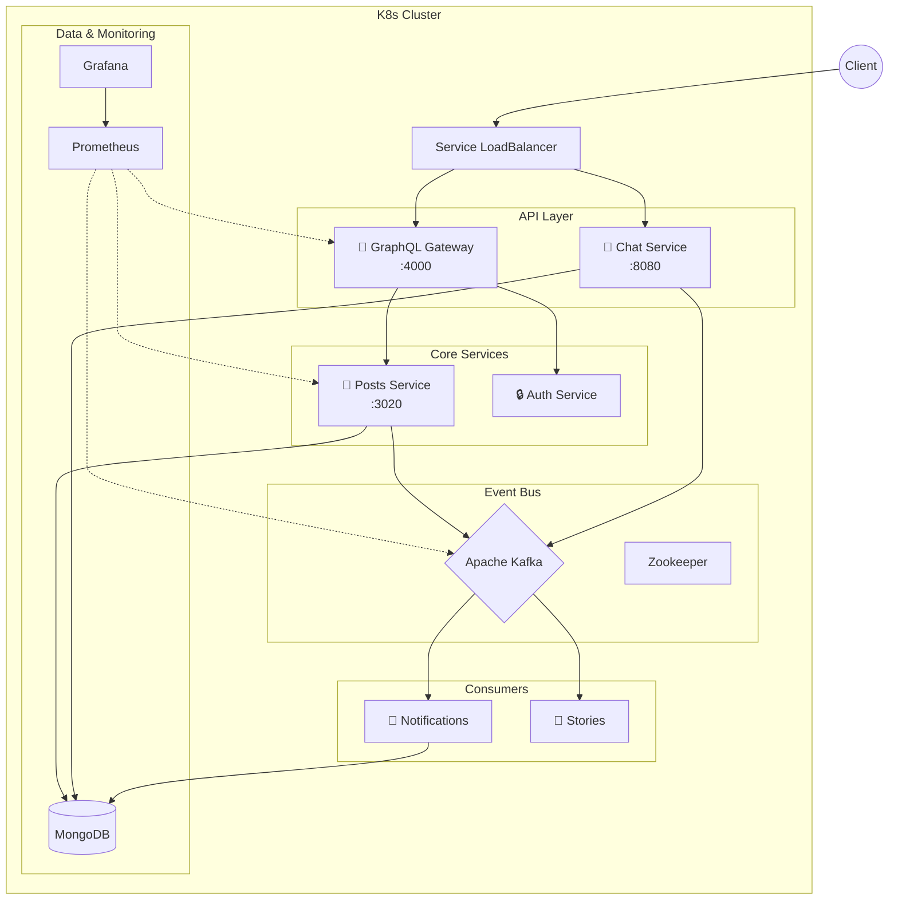
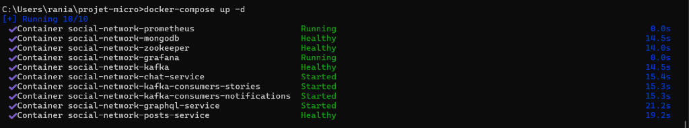

# 📱 Réseau Social Microservices


Ce projet est une plateforme de réseau social scalable construite sur une architecture **microservices**. Il démontre l'utilisation de **Docker**, **Kubernetes**, **Kafka** et **GraphQL** pour créer une application résiliente et observable.

---

## 🏗️ Architecture

Le système est composé de services découplés communiquant de manière asynchrone via Kafka et synchrone via gRPC/REST.



### Services Principaux
- **GraphQL Gateway** : Point d'entrée unique aggregeant les données des microservices.
- **Posts Service** : Gestion des publications, commentaires et likes.
- **Chat Service** : Messagerie temps réel utilisant gRPC pour la performance.
- **Kafka Consumers** : Traitement asynchrone pour les notifications et les stories.

---

## 📋 1. Prérequis

Assurez-vous d'avoir l'environnement suivant prêt :

| Outil | Version Min | Usage |
|-------|-------------|-------|
| **Docker Desktop** | Latest | Runtime conteneur & Cluster K8s local |
| **kubectl** | Latest | CLI pour interagir avec le cluster |
| **Helm** | 3.x | Gestionnaire de paquets pour K8s |
| **Git** | Latest | Gestion de version |

---

## 🚀 2. Installation & Démarrage

### A. Récupération du Projet
```bash
git clone <votre-url-repo>
cd projet-micro
```

### B. Démarrage Rapide (Docker Compose)
Pour un environnement de développement léger sans Kubernetes :
```bash
docker-compose up -d
```

### C. Déploiement Kubernetes (Production-Like)
Pour simuler un environnement de production complet :

**Étape 1 : Infrastructure (Data & Messaging)**
```bash
kubectl apply -f k8s/base/
# Attend que Kafka et Mongo soient prêts...
```

**Étape 2 : Microservices**
```bash
kubectl apply -f k8s/services/posts-service/deployment.yaml
kubectl apply -f k8s/services/chat-service/deployment.yaml
kubectl apply -f k8s/services/graphql-service/deployment.yaml
kubectl apply -f k8s/services/kafka-consumers/deployment.yaml
```

**Étape 3 : Observabilité (Prometheus & Grafana)**
```bash
kubectl apply -f k8s/monitoring/
```

---

## 🧪 3. Tests & validation

### Endpoints Applicatifs
| Service | URL / Commande | Description |
|---------|----------------|-------------|
| **GraphQL Playground** | [http://localhost:4000/graphql](http://localhost:4000/graphql) | Interface interactive pour tester les requêtes |
| **API Posts** | `curl http://localhost:3020/posts` | API REST directe (interne) |
| **Chat** | `ws://localhost:8080` | WebSocket pour le chat temps réel |

### Accès Monitoring (Port-Forwarding)
Pour contourner les restrictions réseau ou les conflits de ports locaux :

**📊 Grafana** (Dashboarding)
```powershell
kubectl port-forward svc/grafana 3001:3000 -n monitoring
# Accès : http://localhost:3001 (admin/admin)
```

**📈 Prometheus** (Métriques)
```powershell
kubectl port-forward svc/prometheus-server 9091:80 -n monitoring
# Accès : http://localhost:9091
```

**⚙️ Jenkins** (CI/CD)
```powershell
kubectl port-forward svc/jenkins 8082:8080 -n jenkins
# Accès : http://localhost:8082 (admin/admin123)
```

---

## 📸 4. Galerie & Captures

### 🌐 Vue d'ensemble ArgoCD
Visualisation GitOps de l'état de synchronisation du cluster.


### 🖥️ Grafana - Monitoring Node
Métriques bas niveau (CPU, RAM, I/O) des noeuds du cluster.


### 🕸️ Grafana - Réseau
Analyse du trafic inter-services.


### 🏗️ Jenkins CI/CD
Pipeline automatisé de build et déploiement.


### 🔍 Prometheus
Exploration des métriques brutes pour le debugging.


---

## �️ Validation en Ligne de Commande (CLI)

En plus des interfaces graphiques, voici les preuves de bon fonctionnement via le terminal.

### 1. Construction des Images
Succès du build Docker Compose pour tous les services.


### 2. Démarrage des Conteneurs
Lancement réussi de la stack complète via `docker-compose up -d`.


### 3. État des Services (Healthcheck)
Tous les conteneurs passent au statut `healthy` après l'initialisation.


### 4. Tests de Connectivité (Curl)
Validation manuelle des endpoints de santé pour GraphQL, Posts Service et Prometheus.


### 5. Mise en place des Tunnels (Port-Forwarding)
Preuve que les accès sécurisés aux outils de monitoring et CI/CD sont actifs.

**Jenkins (Port 8082)**


**Grafana (Port 3001)**


**Prometheus (Port 9091)**


---

## 🔧 Dépannage

**Q: Les pods restent en `Pending` ?**
> R: Vérifiez les ressources allouées à Docker Desktop (Min 4GB RAM recommandés).

**Q: Erreur `CrashLoopBackOff` sur Kafka ?**
> R: Kafka est sensible. Essayez de redémarrer Zookeeper d'abord : `kubectl rollout restart deployment zookeeper -n social-network`.

**Q: Pas de métriques dans Grafana ?**
> R: Vérifiez que les "ServiceMonitors" ou les annotations Prometheus sont bien présentes sur les pods : `kubectl get pods -o wide`.
