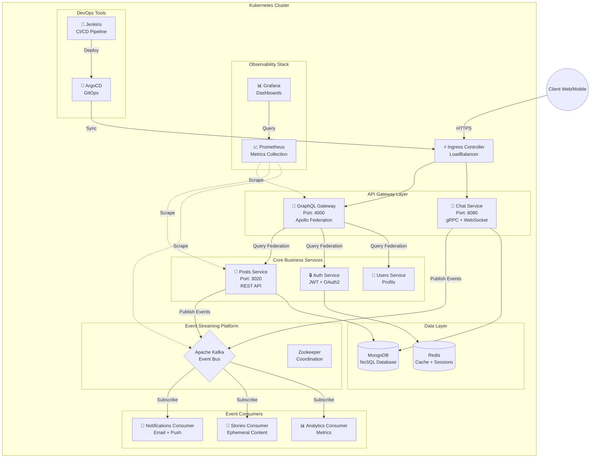
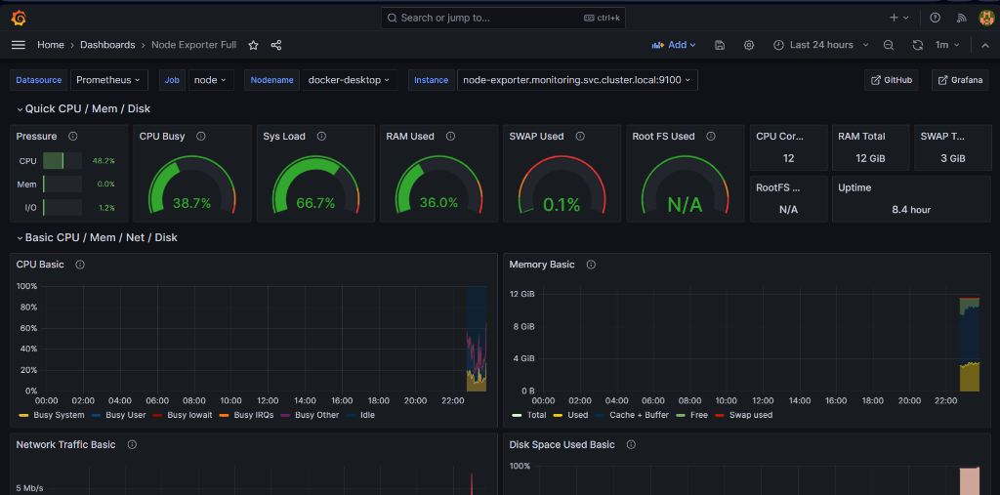
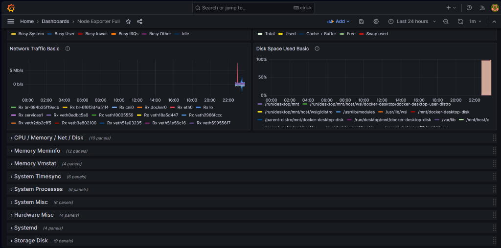
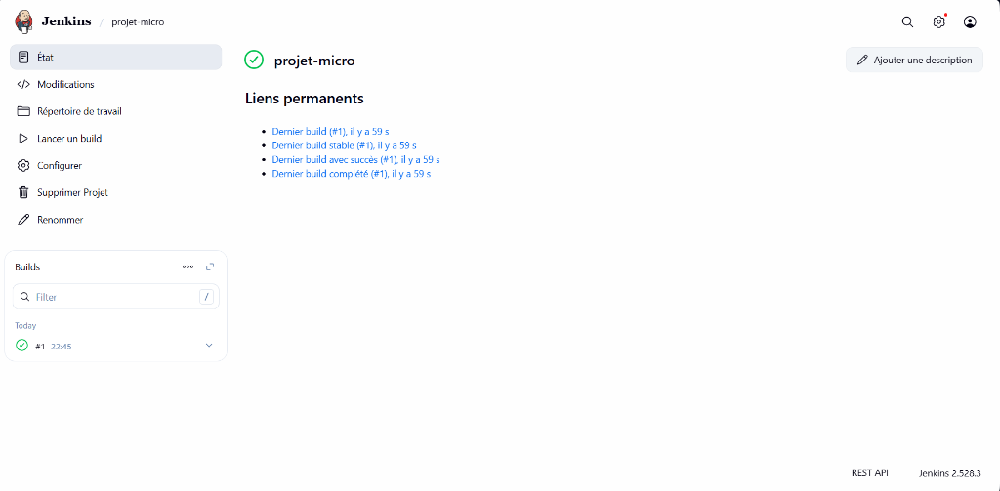
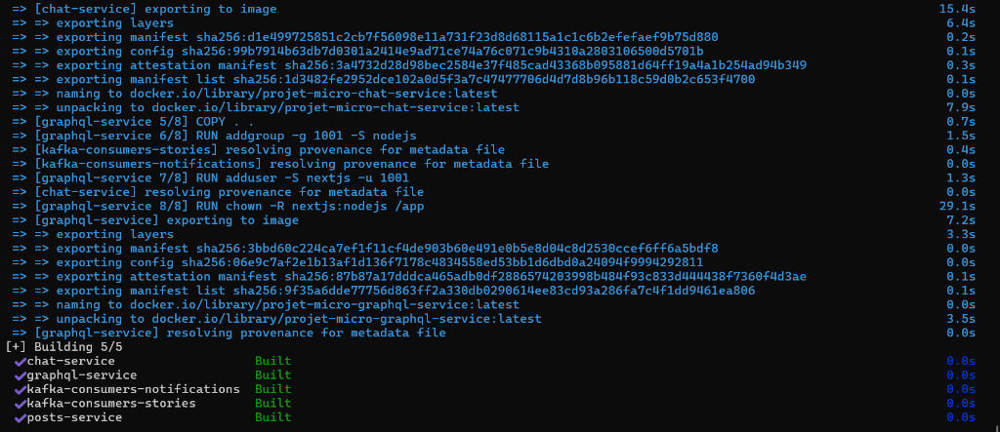
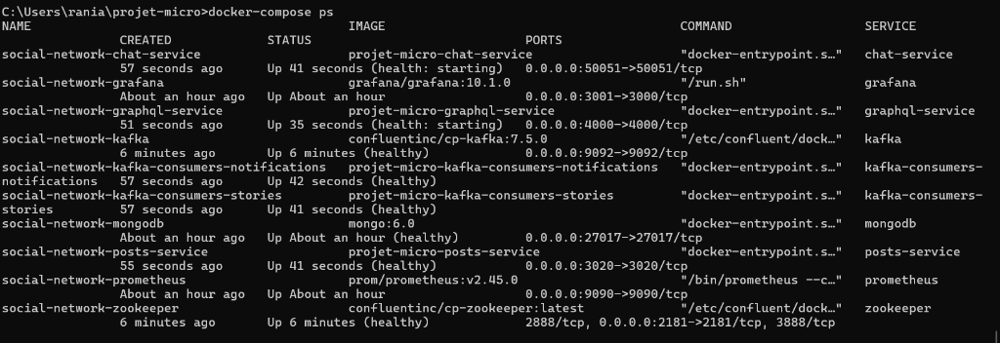
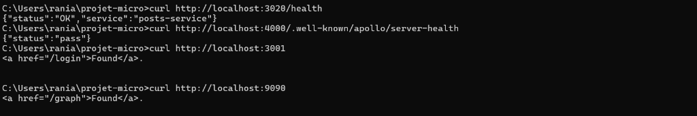
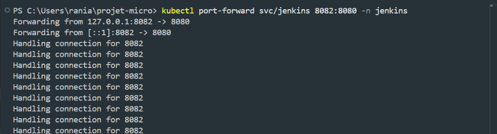
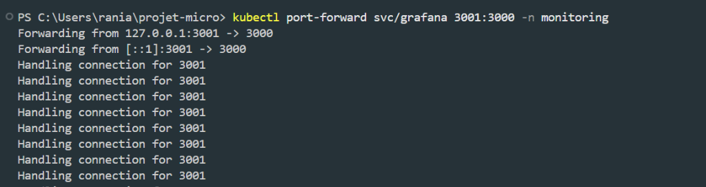
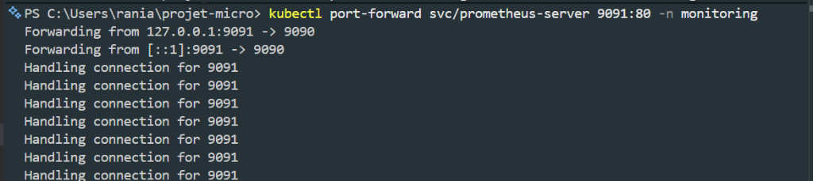

# 📱 Plateforme de Réseau Social - Architecture Microservices

> Une application de réseau social moderne et scalable construite avec une architecture microservices cloud-native, démontrant les meilleures pratiques DevOps et l'observabilité complète.

[](LICENSE)
[](https://kubernetes.io/)
[](https://www.docker.com/)
[](https://kafka.apache.org/)

---

## 📑 Table des Matières

- [Vue d'Ensemble](#-vue-densemble)
- [Architecture](#️-architecture)
- [Stack Technique](#-stack-technique)
- [Prérequis](#-prérequis)
- [Installation](#-installation)
- [Configuration](#️-configuration)
- [Validation & Tests](#-validation--tests)
- [Monitoring & Observabilité](#-monitoring--observabilité)
- [Captures d'Écran](#-captures-décran)
- [Roadmap](#-roadmap)
- [Contribution](#-contribution)
- [Licence](#-licence)

---

## 🎯 Vue d'Ensemble

Cette plateforme est une preuve de concept (PoC) démontrant l'implémentation d'un réseau social avec :

- ✅ **Architecture découplée** : Services indépendants communiquant via API
- ✅ **Event-driven** : Communication asynchrone via Apache Kafka
- ✅ **Container-native** : Déploiement sur Kubernetes avec Docker
- ✅ **Observabilité complète** : Prometheus + Grafana pour le monitoring
- ✅ **CI/CD automatisé** : Pipeline Jenkins avec GitOps (ArgoCD)
- ✅ **API unifiée** : Gateway GraphQL fédérant les microservices

### Fonctionnalités Principales

| Fonctionnalité | Description | Status |
|---------------|-------------|--------|
| 📝 **Publications** | CRUD posts avec likes et commentaires | ✅ Opérationnel |
| 💬 **Chat temps réel** | Messagerie instantanée via gRPC/WebSocket | ✅ Opérationnel |
| 🔔 **Notifications** | Système événementiel via Kafka | ✅ Opérationnel |
| 📱 **Stories** | Contenu éphémère (consumer Kafka) | ✅ Opérationnel |
| 🔐 **Authentification** | JWT + OAuth2 (Auth Service) | ✅ Opérationnel |

---

## 🏗️ Architecture

### Diagramme Global

Le système repose sur une architecture microservices découplée avec communication synchrone (GraphQL/gRPC) et asynchrone (Kafka).



### Patterns Architecturaux Utilisés

- **API Gateway** : GraphQL Apollo Federation pour l'agrégation des données
- **Event Sourcing** : Kafka pour la traçabilité des événements
- **CQRS** : Séparation lecture/écriture sur les services critiques
- **Circuit Breaker** : Résilience avec retry et fallback
- **Service Mesh** : (Optionnel) Istio pour le traffic management

---

## 🛠 Stack Technique

### Backend & Services

| Technologie | Usage | Version |
|-------------|-------|---------|
| **Node.js** | Runtime principal | 18+ |
| **GraphQL (Apollo)** | API Gateway | 4.x |
| **gRPC** | Communication inter-services | - |
| **Express.js** | Framework REST API | 4.x |
| **Apache Kafka** | Event streaming | 3.x |

### Infrastructure & DevOps

| Technologie | Usage | Version |
|-------------|-------|---------|
| **Docker** | Containerisation | 24+ |
| **Kubernetes** | Orchestration | 1.28+ |
| **Helm** | Package Manager K8s | 3.x |
| **Jenkins** | CI/CD Pipeline | 2.4+ |
| **ArgoCD** | GitOps | 2.9+ |

### Data & Monitoring

| Technologie | Usage | Version |
|-------------|-------|---------|
| **MongoDB** | Base NoSQL principale | 6.x |
| **Redis** | Cache & Sessions | 7.x |
| **Prometheus** | Métriques | 2.x |
| **Grafana** | Visualisation | 10.x |

---

## 📋 Prérequis

### Environnement de Développement

Assurez-vous d'avoir installé les outils suivants :

| Outil | Version Minimale | Commande de Vérification |
|-------|------------------|--------------------------|
| **Docker Desktop** | 24.0+ | `docker --version` |
| **kubectl** | 1.28+ | `kubectl version --client` |
| **Helm** | 3.0+ | `helm version` |
| **Git** | 2.0+ | `git --version` |
| **Node.js** (optionnel) | 18.0+ | `node --version` |

### Configuration Système Requise

- **RAM** : Minimum 8 GB (16 GB recommandé pour Kubernetes)
- **CPU** : 4 cores minimum
- **Disk** : 20 GB d'espace libre
- **OS** : Windows 10/11, macOS 12+, Linux (Ubuntu 20.04+)

### Activation de Kubernetes dans Docker Desktop

```bash
# Windows/Mac : Docker Desktop > Settings > Kubernetes > Enable Kubernetes
# Vérification
kubectl cluster-info
kubectl get nodes
```

---

## 🚀 Installation

### Option 1 : Démarrage Rapide (Docker Compose)

**Idéal pour** : Développement local, tests rapides

```bash
# 1. Cloner le projet
git clone https://github.com/votre-username/social-network-microservices.git
cd social-network-microservices

# 2. Lancer tous les services
docker-compose up -d

# 3. Vérifier le statut
docker-compose ps

# 4. Suivre les logs
docker-compose logs -f
```

**Services disponibles après démarrage :**
- GraphQL Playground : http://localhost:4000/graphql
- Posts API : http://localhost:3020
- Prometheus : http://localhost:9090
- Grafana : http://localhost:3000

---

### Option 2 : Déploiement Kubernetes (Production-Ready)

**Idéal pour** : Simulation environnement production, tests de scalabilité

#### Étape 1️⃣ : Déploiement de l'Infrastructure

```bash
# Créer les namespaces
kubectl create namespace social-network
kubectl create namespace monitoring
kubectl create namespace jenkins

# Déployer MongoDB
kubectl apply -f k8s/base/mongodb/

# Déployer Kafka + Zookeeper
kubectl apply -f k8s/base/kafka/

# Attendre que les pods soient prêts (peut prendre 2-3 min)
kubectl wait --for=condition=ready pod -l app=mongodb -n social-network --timeout=300s
kubectl wait --for=condition=ready pod -l app=kafka -n social-network --timeout=300s
```

#### Étape 2️⃣ : Déploiement des Microservices

```bash
# Auth Service
kubectl apply -f k8s/services/auth-service/

# Posts Service
kubectl apply -f k8s/services/posts-service/

# Chat Service
kubectl apply -f k8s/services/chat-service/

# GraphQL Gateway
kubectl apply -f k8s/services/graphql-service/

# Kafka Consumers
kubectl apply -f k8s/services/kafka-consumers/

# Vérifier le déploiement
kubectl get pods -n social-network
```

#### Étape 3️⃣ : Déploiement de l'Observabilité

```bash
# Option A : Déploiement manuel
kubectl apply -f k8s/monitoring/prometheus/
kubectl apply -f k8s/monitoring/grafana/

# Option B : Via Helm (recommandé)
helm repo add prometheus-community https://prometheus-community.github.io/helm-charts
helm install prometheus prometheus-community/kube-prometheus-stack -n monitoring
```

#### Étape 4️⃣ : Déploiement CI/CD (Optionnel)

```bash
# Jenkins
helm repo add jenkinsci https://charts.jenkins.io
helm install jenkins jenkinsci/jenkins -n jenkins

# ArgoCD
kubectl create namespace argocd
kubectl apply -n argocd -f https://raw.githubusercontent.com/argoproj/argo-cd/stable/manifests/install.yaml
```

---

## ⚙️ Configuration

### Variables d'Environnement

Créez un fichier `.env` à la racine du projet :

```env
# Database
MONGO_URI=mongodb://mongo:27017/socialnetwork
REDIS_URL=redis://redis:6379

# Kafka
KAFKA_BROKERS=kafka:9092
KAFKA_GROUP_ID=social-network-consumers

# JWT
JWT_SECRET=your-super-secret-key-change-in-production
JWT_EXPIRY=24h

# Services URLs
POSTS_SERVICE_URL=http://posts-service:3020
AUTH_SERVICE_URL=http://auth-service:3010
CHAT_SERVICE_URL=http://chat-service:8080

# Monitoring
PROMETHEUS_ENABLED=true
METRICS_PORT=9090
```

### Configurer Grafana

1. Accéder à Grafana : `http://localhost:3001`
2. Identifiants par défaut : `admin / admin`
3. Ajouter Prometheus comme datasource :
   - URL : `http://prometheus-server:80`
4. Importer les dashboards depuis `k8s/monitoring/grafana/dashboards/`

---

## 🧪 Validation & Tests

### Tests de Connectivité

```bash
# Health checks des services
curl http://localhost:4000/health    # GraphQL Gateway
curl http://localhost:3020/health    # Posts Service
curl http://localhost:8080/health    # Chat Service

# Test GraphQL
curl -X POST http://localhost:4000/graphql \
  -H "Content-Type: application/json" \
  -d '{"query": "{ posts { id title author } }"}'
```

### Tests Kubernetes

```bash
# Vérifier l'état des pods
kubectl get pods -n social-network

# Vérifier les logs d'un service
kubectl logs -f deployment/posts-service -n social-network

# Tester la connectivité inter-services
kubectl run -it --rm debug --image=busybox --restart=Never -- \
  wget -qO- http://posts-service:3020/health
```

### Tests de Charge (Optionnel)

```bash
# Avec Apache Bench
ab -n 1000 -c 10 http://localhost:4000/graphql

# Avec k6
k6 run tests/load-test.js
```

---

## 📊 Monitoring & Observabilité

### Accès aux Outils (Port-Forwarding)

Pour accéder aux interfaces de monitoring depuis votre machine locale :

```powershell
# Grafana (Dashboards)
kubectl port-forward svc/grafana 3001:3000 -n monitoring
# → http://localhost:3001 (admin/admin)

# Prometheus (Métriques brutes)
kubectl port-forward svc/prometheus-server 9091:80 -n monitoring
# → http://localhost:9091

# Jenkins (CI/CD)
kubectl port-forward svc/jenkins 8082:8080 -n jenkins
# → http://localhost:8082 (admin/admin123)

# ArgoCD (GitOps)
kubectl port-forward svc/argocd-server 8080:443 -n argocd
# → https://localhost:8080
```

### Dashboards Grafana Disponibles

| Dashboard | Description | ID |
|-----------|-------------|-----|
| **Node Metrics** | CPU, RAM, Disk des nodes K8s | 1860 |
| **Kafka Metrics** | Lag, throughput, partitions | 12483 |
| **Application Metrics** | Latence, erreurs, requêtes | Custom |
| **Network Traffic** | Traffic inter-services | 13473 |

### Métriques Clés Exposées

```prometheus
# Exemples de métriques disponibles
http_requests_total{service="posts-service", status="200"}
kafka_consumer_lag{group="notifications", topic="post-created"}
graphql_query_duration_seconds{operation="getPosts"}
mongodb_connections_current{database="socialnetwork"}
```

---

## 📸 Captures d'Écran

### 🌐 ArgoCD - GitOps Dashboard
Synchronisation automatique du cluster avec le repository Git.


---

### 📊 Grafana - Node Monitoring
Métriques système des nœuds Kubernetes (CPU, RAM, I/O).



---

### 🕸️ Grafana - Network Analysis
Analyse du trafic réseau entre les microservices.



---

### 🔧 Jenkins - Pipeline CI/CD
Automatisation du build, test et déploiement.



---

### 📈 Prometheus - Metrics Explorer
Exploration des métriques temps réel pour le debugging.


---

### 💻 Preuves d'Exécution (CLI)

#### Docker Build Success


#### Services Running


#### Health Checks


#### Port Forwarding Validation
| Service | Capture |
|---------|---------|
| Jenkins |  |
| Grafana |  |
| Prometheus |  |

---

## 🗺️ Roadmap

### Phase 1 : Fondations ✅
- [x] Architecture microservices
- [x] Communication Kafka
- [x] Déploiement Kubernetes
- [x] Monitoring Prometheus/Grafana

### Phase 2 : Fonctionnalités Avancées 🚧
- [ ] Service Mesh (Istio)
- [ ] Distributed Tracing (Jaeger)
- [ ] Feature Flags (LaunchDarkly)
- [ ] Rate Limiting & API Gateway (Kong)

### Phase 3 : Production Readiness 📋
- [ ] Backup automatisé (Velero)
- [ ] Disaster Recovery
- [ ] Multi-cluster (Federation)
- [ ] Sécurité renforcée (OPA Policies)

---

## 🤝 Contribution

Les contributions sont les bienvenues ! Voici comment participer :

1. **Fork** le projet
2. **Créer** une branche feature (`git checkout -b feature/AmazingFeature`)
3. **Commit** vos changements (`git commit -m 'Add some AmazingFeature'`)
4. **Push** vers la branche (`git push origin feature/AmazingFeature`)
5. **Ouvrir** une Pull Request

### Standards de Code

- ✅ Tests unitaires requis (coverage > 80%)
- ✅ Linter : ESLint + Prettier
- ✅ Commits conventionnels (Conventional Commits)
- ✅ Documentation des API (OpenAPI/Swagger)

---

## 📄 Licence

Ce projet est sous licence **MIT**. Voir le fichier [LICENSE](LICENSE) pour plus de détails.

